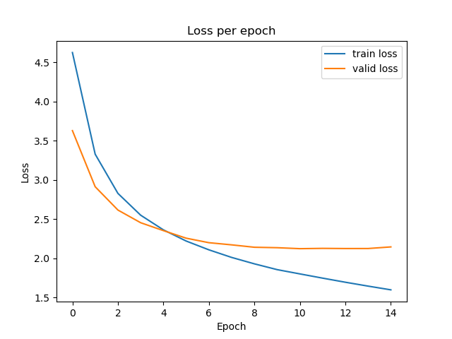

# Table of Contents
- [Table of Contents](#table-of-contents)
- [Transformer - Attention is all you need - Pytorch Implementation](#transformer---attention-is-all-you-need---pytorch-implementation)
- [Models](#models)
  - [Positional Encoding](#positional-encoding)
  - [Scaled Dot-Product Attention](#scaled-dot-product-attention)
  - [Multi-Head Attention](#multi-head-attention)
  - [Encoder](#encoder)
    - [Encoder Layer](#encoder-layer)
    - [Encoder](#encoder-1)
  - [Decoder](#decoder)
    - [Decoder Layer](#decoder-layer)
    - [Decoder](#decoder-1)
  - [Transformer](#transformer)
- [Training](#training)
  - [Download the dataset](#download-the-dataset)
  - [Train the model](#train-the-model)
- [Evaluation](#evaluation)
- [Inference](#inference)
- [References](#references)

# Transformer - Attention is all you need - Pytorch Implementation

This is a PyTorch implementation of the Transformer model in the paper [Attention is All You Need](https://arxiv.org/abs/1706.03762) (Ashish Vaswani, Noam Shazeer, Niki Parmar, Jakob Uszkoreit, Llion Jones, Aidan N. Gomez, Lukasz Kaiser, Illia Polosukhin, arxiv, 2017).

In this implementation, I will train the model on the machine translation task from English to Vietnamese, with the data used [here](https://drive.google.com/file/d/1Fuo_ALIFKlUvOPbK5rUA5OfAS2wKn_95/view) ([This is](https://github.com/pbcquoc/transformer) the original reference repository)

> The official Tensorflow Implementation can be found in: [tensorflow/tensor2tensor](https://github.com/tensorflow/tensor2tensor/blob/master/tensor2tensor/models/transformer.py).


<p align="center">

</p>


The project support training and translation with trained model now.

If there is any suggestion or error, feel free to fire an issue to let me know. :)

The directory structure of this project is shown below:
```bash
transformer/            # this repository
├── data_en_vi/         # data directory
├── logs/               # log directory
├── datasets.py
├── evaluate.py
├── models.py
├── README.md
├── train.py
├── translate.py
└── utils.py
```

---
# Models

## Positional Encoding
The positional encodings have the same dimension d_model as the embeddings, so that the two can be summed.
<!-- $$PE_{(pos, 2i)}=sin(\frac{pos}{10000^{2i/d_{model}}})$$

$$PE_{(pos, 2i+1)}=cos(\frac{pos}{10000^{2i/d_{model}}})$$ -->

<p align="center">

</p>


```python
# The positional encoding vector, embedding_dim is d_model
class PositionalEncoder(nn.Module):
    def __init__(self, embedding_dim, max_seq_length=512, dropout=0.1):
        super(PositionalEncoder, self).__init__()
        self.embedding_dim = embedding_dim
        self.dropout = nn.Dropout(dropout)
        pe = torch.zeros(max_seq_length, embedding_dim)
        for pos in range(max_seq_length):
            for i in range(0, embedding_dim, 2):
                pe[pos, i] = math.sin(pos/(10000**(2*i/embedding_dim)))
                pe[pos, i+1] = math.cos(pos/(10000**((2*i+1)/embedding_dim)))
        pe = pe.unsqueeze(0)        
        self.register_buffer('pe', pe)
    
    def forward(self, x):
        x = x*math.sqrt(self.embedding_dim)
        seq_length = x.size(1)
        pe = Variable(self.pe[:, :seq_length], requires_grad=False).to(x.device)
        # Add the positional encoding vector to the embedding vector
        x = x + pe
        x = self.dropout(x)
        return x
```

## Scaled Dot-Product Attention

<!-- $$Attention(Q, K, V ) = softmax(\frac{QK^T}{\sqrt{d_k}})V$$ -->
<p align="center">

</p>


```python
# Self-attention layer
class SelfAttention(nn.Module):
    ''' Scaled Dot-Product Attention '''

    def __init__(self, dropout=0.1):
        super(SelfAttention, self).__init__()
        self.dropout = nn.Dropout(dropout)

    def forward(self, query, key, value, mask=None):
        key_dim = key.size(-1)
        attn = torch.matmul(query / np.sqrt(key_dim), key.transpose(2, 3))
        if mask is not None:
            mask = mask.unsqueeze(1)
            attn = attn.masked_fill(mask == 0, -1e9)
        attn = self.dropout(torch.softmax(attn, dim=-1))
        output = torch.matmul(attn, value)

        return output
```

## Multi-Head Attention

<!-- $$MultiHead(Q, K, V ) = Concat(head_1,..., head_h)W_O$$

$$head_i = Attention(QWQ_i^Q, KW^K_i,VW^V_i)$$ -->

<p align="center">

</p>

```python
# Multi-head attention layer
class MultiHeadAttention(nn.Module):
    def __init__(self, embedding_dim, num_heads, dropout=0.1):
        super(MultiHeadAttention, self).__init__()
        self.embedding_dim = embedding_dim
        self.self_attention = SelfAttention(dropout)
        # The number of heads
        self.num_heads = num_heads
        # The dimension of each head
        self.dim_per_head = embedding_dim // num_heads
        # The linear projections
        self.query_projection = nn.Linear(embedding_dim, embedding_dim)
        self.key_projection = nn.Linear(embedding_dim, embedding_dim)
        self.value_projection = nn.Linear(embedding_dim, embedding_dim)
        self.dropout = nn.Dropout(dropout)
        self.out = nn.Linear(embedding_dim, embedding_dim)

    def forward(self, query, key, value, mask=None):
        # Apply the linear projections
        batch_size = query.size(0)
        query = self.query_projection(query)
        key = self.key_projection(key)
        value = self.value_projection(value)
        # Reshape the input
        query = query.view(batch_size, -1, self.num_heads, self.dim_per_head).transpose(1, 2)
        key = key.view(batch_size, -1, self.num_heads, self.dim_per_head).transpose(1, 2)
        value = value.view(batch_size, -1, self.num_heads, self.dim_per_head).transpose(1, 2)
        # Calculate the attention
        scores = self.self_attention(query, key, value, mask)
        # Reshape the output
        output = scores.transpose(1, 2).contiguous().view(batch_size, -1, self.embedding_dim)
        # Apply the linear projection
        output = self.out(output)
        return output
```
## Encoder
### Encoder Layer
```python
# Transformer encoder layer
class EncoderLayer(nn.Module):
    def __init__(self, embedding_dim, num_heads, ff_dim=2048, dropout=0.1):
        super(EncoderLayer, self).__init__()
        self.self_attention = MultiHeadAttention(embedding_dim, num_heads, dropout)
        self.feed_forward = nn.Sequential(
            nn.Linear(embedding_dim, ff_dim),
            nn.ReLU(),
            nn.Linear(ff_dim, embedding_dim)
        )
        self.dropout1 = nn.Dropout(dropout)
        self.dropout2 = nn.Dropout(dropout)
        self.norm1 = Norm(embedding_dim)
        self.norm2 = Norm(embedding_dim)

    def forward(self, x, mask=None):
        x2 = self.norm1(x)
        # Add and Muti-head attention
        x = x + self.dropout1(self.self_attention(x2, x2, x2, mask))
        x2 = self.norm2(x)
        x = x + self.dropout2(self.feed_forward(x2))
        return x
```

<!-- <p align="center">

</p> -->

<figure>
<p align="center">

</p>
<figcaption>
Encoder: The encoder is composed of a stack of <b>N = 6</b> identical layers. Each layer has two sub-layers. The first is a multi-head self-attention mechanism, and the second is a simple, positionwise fully connected feed-forward network. We employ a residual connection around each of the two sub-layers, followed by layer normalization. That is, the output of each sub-layer is LayerNorm(x + Sublayer(x)), where Sublayer(x) is the function implemented by the sub-layer itself. To facilitate these residual connections, all sub-layers in the model, as well as the embedding layers, produce outputs of dimension.
</figcaption>
</figure>

### Encoder
```python
# Encoder transformer
class Encoder(nn.Module):
    def __init__(self, vocab_size, embedding_dim, max_seq_len, num_heads, num_layers, dropout=0.1):
        super(Encoder, self).__init__()
        self.embedding = nn.Embedding(vocab_size, embedding_dim)
        self.num_layers = num_layers
        self.num_heads = num_heads
        self.embedding_dim = embedding_dim
        self.layers = nn.ModuleList([EncoderLayer(embedding_dim, num_heads, 2048, dropout) for _ in range(num_layers)])
        self.norm = Norm(embedding_dim)
        self.position_embedding = PositionalEncoder(embedding_dim, max_seq_len, dropout)
    
    def forward(self, source, source_mask):
        # Embed the source
        x = self.embedding(source)
        # Add the position embeddings
        x = self.position_embedding(x)
        # Propagate through the layers
        for layer in self.layers:
            x = layer(x, source_mask)
        # Normalize
        x = self.norm(x)
        return x
```

## Decoder
### Decoder Layer
Decoder: The decoder is also composed of a stack of *N = 6* identical layers. In addition to the two sub-layers in each encoder layer, the decoder inserts a third sub-layer, which performs multi-head attention over the output of the encoder stack. Similar to the encoder, we employ residual connections around each of the sub-layers, followed by layer normalization. We also modify the self-attention sub-layer in the decoder stack to prevent positions from attending to subsequent positions. This masking, combined with fact that the output embeddings are offset by one position, ensures that the predictions for position *i* can depend only on the known outputs at positions less than *i*.

```python
# Transformer decoder layer
class DecoderLayer(nn.Module):
    def __init__(self, embedding_dim, num_heads, ff_dim=2048, dropout=0.1):
        super(DecoderLayer, self).__init__()
        self.self_attention = MultiHeadAttention(embedding_dim, num_heads, dropout)
        self.encoder_attention = MultiHeadAttention(embedding_dim, num_heads, dropout)
        self.feed_forward = nn.Sequential(
            nn.Linear(embedding_dim, ff_dim),
            nn.ReLU(),
            nn.Linear(ff_dim, embedding_dim)
        )
        self.dropout1 = nn.Dropout(dropout)
        self.dropout2 = nn.Dropout(dropout)
        self.dropout3 = nn.Dropout(dropout)
        self.norm1 = Norm(embedding_dim)
        self.norm2 = Norm(embedding_dim)
        self.norm3 = Norm(embedding_dim)

    def forward(self, x, memory, source_mask, target_mask):
        x2 = self.norm1(x)
        x = x + self.dropout1(self.self_attention(x2, x2, x2, target_mask))
        x2 = self.norm2(x)
        x = x + self.dropout2(self.encoder_attention(x2, memory, memory, source_mask))
        x2 = self.norm3(x)
        x = x + self.dropout3(self.feed_forward(x2))
        return x
```
### Decoder
```python
# Decoder transformer
class Decoder(nn.Module):
    def __init__(self, vocab_size, embedding_dim, max_seq_len,num_heads, num_layers, dropout=0.1):
        super(Decoder, self).__init__()
        self.embedding = nn.Embedding(vocab_size, embedding_dim)
        self.layers = nn.ModuleList([DecoderLayer(embedding_dim, num_heads, 2048, dropout) for _ in range(num_layers)])
        self.norm = Norm(embedding_dim)
        self.position_embedding = PositionalEncoder(embedding_dim, max_seq_len, dropout)
    
    def forward(self, target, memory, source_mask, target_mask):
        # Embed the source
        x = self.embedding(target)
        # Add the position embeddings
        x = self.position_embedding(x)
        # Propagate through the layers
        for layer in self.layers:
            x = layer(x, memory, source_mask, target_mask)
        # Normalize
        x = self.norm(x)
        return x
```

## Transformer
```python
# Transformers
class Transformer(nn.Module):
    def __init__(self, source_vocab_size, target_vocab_size, source_max_seq_len, target_max_seq_len, embedding_dim, num_heads, num_layers, dropout=0.1):
        super(Transformer, self).__init__()
        self.encoder = Encoder(source_vocab_size, embedding_dim, source_max_seq_len, num_heads, num_layers, dropout)
        self.decoder = Decoder(target_vocab_size, embedding_dim, target_max_seq_len, num_heads, num_layers, dropout)
        self.final_linear = nn.Linear(embedding_dim, target_vocab_size)
        self.dropout = nn.Dropout(dropout)
    
    def forward(self, source, target, source_mask, target_mask):
        # Encoder forward pass
        memory = self.encoder(source, source_mask)
        # Decoder forward pass
        output = self.decoder(target, memory, source_mask, target_mask)
        # Final linear layer
        output = self.dropout(output)
        output = self.final_linear(output)
        return output
```

---
# Training
## Download the dataset
```bash
gdown --id 1Fuo_ALIFKlUvOPbK5rUA5OfAS2wKn_95
unzip en_vi.zip
rm en_vi.zip
mv data/ data_en_vi/
```
## Train the model
```bash
python train.py
```
- Parameter settings:
    - batch size 20 
    - n_epochs 50 
    - learning_rate 1e-4
    - cross_entropy loss
    - source_max_seq_len 256
    - target_max_seq_len 256
    - num_heads 8
    - num_layers 6
    - embedding_dim 512
    - dropout 0.1
    - early_stopping 5

All the parameters are defined in the `utils.py` file. You can change them to your own settings.

- Training:
    - Validation loss: 2.1220

Model training until epoch 15 and stop training because of early stopping. Best validation loss is 2.1220. 
<figure>
<p align="center">

<figcaption>Training loss and validation loss for each epoch.</figcaption>
</p>
</figure>

---

# Evaluation
See the file `evaluate.py`.

To evaluate the model on validation data, we use BLEU score. I use NLTK to calculate BLEU score.

```python
from nltk.translate.bleu_score import corpus_bleu
weights = [(0.5, 0.5),(0.333, 0.333, 0.334),(0.25, 0.25, 0.25, 0.25)]
# Calculate BLEU-2 score
bleu_2 = corpus_bleu(references, hypotheses, weights=weights[0])
# Calculate BLEU-3 score
bleu_3 = corpus_bleu(references, hypotheses, weights=weights[1])
# Calculate BLEU-4 score
bleu_4 = corpus_bleu(references, hypotheses, weights=weights[2])
```

My model achieves BLEU-2 is 0.3234, BLEU-3 is 0.2343, BLEU-4 is 0.1715.

# Inference 
See the file `translate.py`. If you don't have the resources to train the model, you can download my [pre-trained model](https://drive.google.com/file/d/1d04LmLaQmIp9slI4v-yXqNyQJVy2r_8o/view?usp=sharing) to use.

```python
from utils import configs
from evaluate import load_model_tokenizer, translate
# Translate a sentence
sentence = "My family is very poor, I had to go through hard life when I was young, now I have a better life."
print("--- English input sentence:", sentence)
print("--- Translating...")
device = torch.device(configs["device"])
model, source_tokenizer, target_tokenizer = load_model_tokenizer(configs)
trans_sen = translate(
    model=model, 
    sentence=sentence, 
    source_tokenizer=source_tokenizer, 
    target_tokenizer=target_tokenizer, 
    target_max_seq_len=configs["target_max_seq_len"], 
    beam_size=configs["beam_size"], 
    device=device
)
print("--- Sentences translated into Vietnamese:", trans_sen)

## Output
--- English input sentence: My family is very poor, I had to go through hard life when I was young, now I have a better life.
--- Translating...
--- Sentences translated into Vietnamese: gia đình tôi rất nghèo, tôi đã phải trải qua cuộc sống khó khăn khi còn trẻ, giờ tôi có một cuộc sống tốt hơn.
```

---
# References
